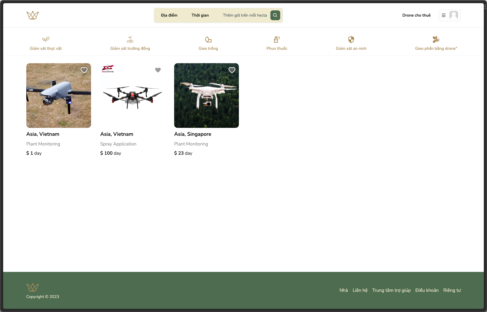

<!-- PROJECT SHIELDS -->

[![Contributors][contributors-shield]][contributors-url]
[![MIT License][license-shield]][license-url]
[![Star][stars-shield]][stars-url]

[![LinkedIn][linkedin-shield]][linkedin-url]

<!-- PROJECT LOGO -->
 

  

  <h3 align="center">UEH Biztech Hackathon - Monarchs (Vietnamese Version)</h3>

  

    Website Application platform for a B2B drone rental service.
     
     
    <a href="https://ueh-biztech-hackathon-viet.vercel.app">View Demo</a>
  

<!-- TABLE OF CONTENTS -->

  
Table of Contents

  <ol>
    <li>
      <a href="#about-the-project">About The Project</a>
      <ul>
        <li><a href="#built-with">Built With</a></li>
      </ul>
    </li>
    <li>
      <a href="#getting-started">Getting Started</a>
      <ul>
        <li><a href="#prerequisites">Prerequisites</a></li>
        <li><a href="#installation">Installation</a></li>
      </ul>
    </li>
    <li><a href="#license">License</a></li>
    <li><a href="#contact">Contact</a></li>
    <li><a href="#acknowledgments">Acknowledgments</a></li>
  </ol>

<!-- ABOUT THE PROJECT -->
## About The Project

Monarch is a startup project submission for UEH (University of Economics HCMC) Biztech Hackathon 2022. This is a 28 hours hackathon in which we seek out solutions for the betterment of the agricultural scene in Mekong Delta. This project was a fork from the AirBnb Clone Project due to the time constraints and the need to do market research and business plans. The codes are not clean but the application is functional.

(<a href="#readme-top">back to top</a>)

### Built With

This section list the major frameworks/libraries used to bootstrap this project.

* [![Next][Next.js]][Next-url]
* [![React][React.js]][React-url]
* [![TailwindCSS][TailwindCSS]][TailwindCSS-url]
* [![TypeScript][TypeScript]][TypeScript-url]

(<a href="#readme-top">back to top</a>)

<!-- LICENSE -->
## License

Distributed under the MIT License. See `LICENSE.txt` for more information.

(<a href="#readme-top">back to top</a>)

<!-- CONTACT -->
## Contact

Your Name - [@j_avianzz](https://twitter.com/j_avianzz)

Project Link: [https://github.com/javianng/ueh-biztech-hackathon-viet](https://github.com/javianng/ueh-biztech-hackathon-viet)

(<a href="#readme-top">back to top</a>)

<!-- MARKDOWN LINKS & IMAGES -->
<!-- https://www.markdownguide.org/basic-syntax/#reference-style-links -->
[contributors-shield]: https://img.shields.io/github/contributors/javianng/ueh-biztech-hackathon-viet.svg?style=for-the-badge
[contributors-url]: https://github.com/othneildrew/Best-README-Template/graphs/contributors

[forks-shield]: https://img.shields.io/github/forks/javianng/ueh-biztech-hackathon-viet.svg?style=for-the-badge
[forks-url]: https://github.com/othneildrew/Best-README-Template/network/members

[stars-shield]: https://img.shields.io/github/stars/javianng/ueh-biztech-hackathon-viet.svg?style=for-the-badge
[stars-url]: https://github.com/javianng/ueh-biztech-hackathon-viet/stargazers

[issues-shield]: https://img.shields.io/github/issues/othneildrew/Best-README-Template.svg?style=for-the-badge
[issues-url]: https://github.com/othneildrew/Best-README-Template/issues

[license-shield]: https://img.shields.io/github/license/othneildrew/Best-README-Template.svg?style=for-the-badge
[license-url]: https://github.com/othneildrew/Best-README-Template/blob/master/LICENSE.txt

[linkedin-shield]: https://img.shields.io/badge/-LinkedIn-black.svg?style=for-the-badge&logo=linkedin&colorB=555

[linkedin-shield]: https://img.shields.io/badge/-LinkedIn-black.svg?style=for-the-badge&logo=linkedin&colorB=555
[linkedin-url]: https://www.linkedin.com/in/javianngzh/

[Next.js]: https://img.shields.io/badge/next.js-000000?style=for-the-badge&logo=nextdotjs&logoColor=white
[Next-url]: https://nextjs.org/

[React.js]: https://img.shields.io/badge/React-20232A?style=for-the-badge&logo=react&logoColor=61DAFB
[React-url]: https://reactjs.org/

[TailwindCSS]: https://img.shields.io/static/v1?style=for-the-badge&message=Tailwind+CSS&color=222222&logo=Tailwind+CSS&logoColor=06B6D4&label=
[TailwindCSS-url]: https://tailwindcss.com/

[TypeScript]: https://img.shields.io/static/v1?style=for-the-badge&message=TypeScript&color=3178C6&logo=TypeScript&logoColor=FFFFFF&label=
[TypeScript-url]: https://www.typescriptlang.org/